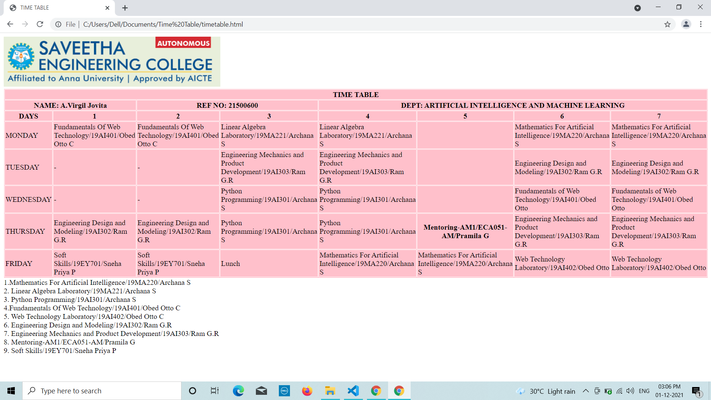
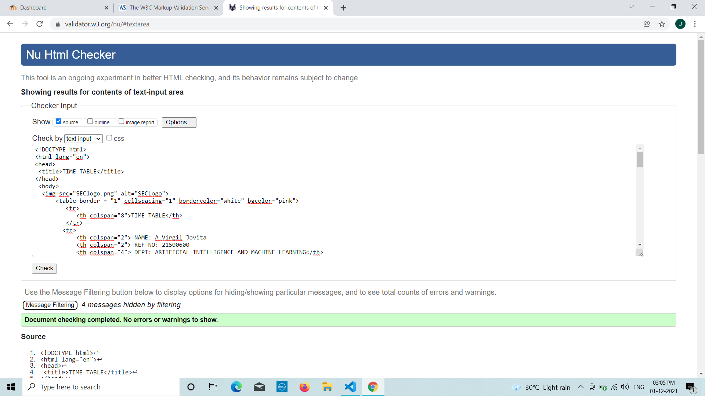

# Experiment_Time_Table

## AIM
To Write a html webpage page to display your timetable.

# ALGORITHM
### STEP 1
create a simple table using table tag
### STEP 2
Add header row using th tag
### STEP 3
Add your timetable
### STEP 4
Execute the program

# CODE
```
<!DOCTYPE html>
<html lang="en">
<head>
 <title>TIME TABLE</title>
</head>
 <body>
  
      <table border = "1" cellspacing="1" bordercolor="white" bgcolor="pink">
         <tr>
            <th colspan="8">TIME TABLE</th>
         </tr>
        <tr>
            <th colspan="2"> NAME: A.Virgil Jovita
            <th colspan="2"> REF NO: 21500600
            <th colspan="4"> DEPT: ARTIFICIAL INTELLIGENCE AND MACHINE LEARNING</th>
        </tr>
        <tr>
           
            <th>DAYS</th>
            <th>1</th>
            <th>2</th>
            <th>3</th>
            <th>4</th>
            <th>5</th>
            <th>6</th>
            <th>7</th>
        </tr>
          <tr>
             <td>MONDAY</td>
             <td>Fundamentals Of Web Technology/19AI401/Obed Otto C</td>
             <td>Fundamentals Of Web Technology/19AI401/Obed Otto C</td>
             <td>Linear Algebra Laboratory/19MA221/Archana S</td>
             <td>Linear Algebra Laboratory/19MA221/Archana S</td>
             <th></th>
             <td>Mathematics For Artificial Intelligence/19MA220/Archana S</td>
             <td>Mathematics For Artificial Intelligence/19MA220/Archana S</td>
          </tr>
          <tr>
             <td>TUESDAY</td>
             <td>-</td>
             <td>-</td>
             <td>Engineering Mechanics and Product Development/19AI303/Ram G.R</td>
             <td>Engineering Mechanics and Product Development/19AI303/Ram G.R</td>
             <th></th>
             <td>Engineering Design and Modeling/19AI302/Ram G.R</td>
             <td>Engineering Design and Modeling/19AI302/Ram G.R</td>
          </tr>
          <tr>
             <td>WEDNESDAY</td>
             <td>-</td>
             <td>-</td>
             <td>Python Programming/19AI301/Archana S</td>
             <td>Python Programming/19AI301/Archana S</td>
             <th> </th>
             <td>Fundamentals of Web Technology/19AI401/Obed Otto</td>
             <td>Fundamentals of Web Technology/19AI401/Obed Otto</td>
          </tr>
          <tr>
             <td>THURSDAY</td>
             <td>Engineering Design and Modeling/19AI302/Ram G.R</td>
             <td>Engineering Design and Modeling/19AI302/Ram G.R</td>
             <td>Python Programming/19AI301/Archana S</td>
             <td>Python Programming/19AI301/Archana S</td>
             <th> Mentoring-AM1/ECA051-AM/Pramila G</th>
             <td>Engineering Mechanics and Product Development/19AI303/Ram G.R </td>
             <td>Engineering Mechanics and Product Development/19AI303/Ram G.R</td>
          </tr>
          <tr>
             <td>FRIDAY</td>
             <td>Soft Skills/19EY701/Sneha Priya P</td>
             <td>Soft Skills/19EY701/Sneha Priya P</td>
             <td>Lunch</td>
             <td>Mathematics For Artificial Intelligence/19MA220/Archana S</td>
             <td>Mathematics For Artificial Intelligence/19MA220/Archana S</td>
             <td>Web Technology Laboratory/19AI402/Obed Otto</td>
             <td>Web Technology Laboratory/19AI402/Obed Otto</td>
          </tr>       
      </table>
       
      1.Mathematics For Artificial Intelligence/19MA220/Archana S<br>
      2. Linear Algebra Laboratory/19MA221/Archana S<br>
      3. Python Programming/19AI301/Archana S<br>
      4.Fundamentals Of Web Technology/19AI401/Obed Otto C<br>
      5. Web Technology Laboratory/19AI402/Obed Otto C<br>
      6. Engineering Design and Modeling/19AI302/Ram G.R<br>
      7. Engineering Mechanics and Product Development/19AI303/Ram G.R<br>
      8. Mentoring-AM1/ECA051-AM/Pramila G<br>
      9. Soft Skills/19EY701/Sneha Priya P<br>
   </body>
</html>

```
# OUPUT


